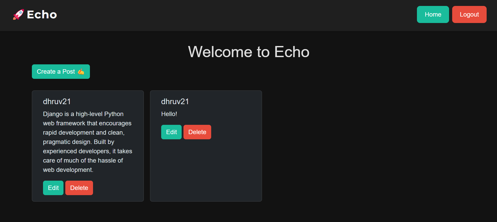

# Echo – A Django Blog Application

## Overview

**Echo** is a simple, functional blog application built with Django. It enables users to perform essential CRUD operations for blog posts, with support for user authentication and image uploads.



---

### Key Capabilities

- Secure user authentication (Sign up, Log in, Log out)  
- Create, update, and delete blog posts  
- Upload and display images with posts  
- View posts from other users  
- Responsive user interface using Bootstrap

## Features

- User registration and login system  
- Full CRUD operations on posts  
- Image upload support  
- Clean, responsive front-end design  

## Tech Stack

- **Backend:** Django, Django ORM  
- **Frontend:** HTML, CSS, Bootstrap  
- **Database:** SQLite (default for development)

---

## Installation & Setup

Follow the steps below to get the project running on your local machine.

### 1. Clone the Repository

```bash
git clone https://github.com/yourusername/DJPost.git
cd DJPost
```

### 2. Create a Virtual Environment and Install Dependencies

```bash
python -m venv venv                  # Create virtual environment
source venv/bin/activate             # Activate on macOS/Linux
venv\Scripts\activate              # Activate on Windows
pip install -r requirements.txt      # Install project dependencies
```

### 3. Apply Migrations and Start the Development Server

```bash
python manage.py migrate             # Apply database migrations
python manage.py runserver           # Start the Django development server
```

Visit `http://127.0.0.1:8000/tweet/` in your browser to access the application.

---

## Folder Structure

```txt
DJPost/
├── blog/
│   ├── migrations/
│   ├── templates/
│   │   └── blog/
│   │       ├── base.html
│   │       ├── home.html
│   │       ├── post_form.html
│   │       └── post_detail.html
│   ├── admin.py
│   ├── apps.py
│   ├── models.py
│   ├── views.py
│   ├── urls.py
│   └── forms.py
├── DJPost/
│   ├── __init__.py
│   ├── settings.py
│   ├── urls.py
│   └── wsgi.py
├── media/
├── db.sqlite3
├── manage.py
└── requirements.txt
```

---

## License

This project is licensed under the MIT License. See the `LICENSE` file for details.

---

## Author

Developed by [Dhruv](https://github.com/dhryvgh)
